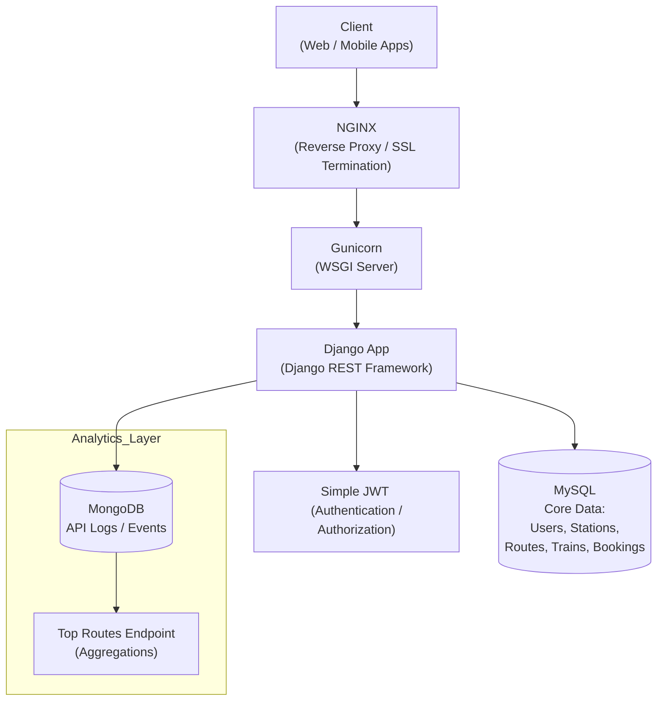

## IRCTC Mini‑System Backend  

A Django + DRF backend that models a simplified IRCTC‑like system with **users**, **stations**, **routes**, **trains**, **bookings**, and **analytics** (MongoDB logs). Authentication uses **Simple JWT**.

---  

### 1. Tech Stack  

| Component | Version / Tool |
|-----------|----------------|
| Backend | Django 5, Django REST Framework |
| Auth | `djangorestframework‑simplejwt` |
| Relational DB | MySQL (transactional data) |
| NoSQL DB | MongoDB (`api_logs` collection) |
| Production server | Gunicorn + WhiteNoise |
| Reverse proxy (optional) | Nginx / Apache |
| Static files | WhiteNoise (`STATIC_ROOT=staticfiles/`) |

---  

### 2. Setup & Local Development  

```bash
# 1️⃣ Clone & create venv
git clone <repo‑url> irctc_backend
cd irctc_backend
python -m venv .venv
source .venv/bin/activate   # Windows: .venv\Scripts\activate

# 2️⃣ Install dependencies
pip install -r requirements.txt

# 3️⃣ Environment variables
cp .env.example .env
# edit .env with your MySQL, MongoDB, and security values

# 4️⃣ Apply migrations
python manage.py migrate

# 5️⃣ Run the development server
python manage.py runserver   # http://127.0.0.1:8000/
```

---  

### 3. Production Deployment & Teardown (bare‑metal / VM)  

#### 3.1 System preparation  

1. Install system packages: `python3‑venv`, `mysql-server`, `mongodb`, `nginx`.  
2. Create a dedicated system user (e.g., `irctc`).  
3. Place the project under `/opt/irctc_backend` and copy the `.env` file there.  

#### 3.2 Gunicorn service (systemd)  

Create `/etc/systemd/system/irctc.service`:

```ini
[Unit]
Description=IRCTC Django application
After=network.target

[Service]
User=irctc
Group=irctc
WorkingDirectory=/opt/irctc_backend
EnvironmentFile=/opt/irctc_backend/.env
ExecStart=/opt/irctc_backend/.venv/bin/gunicorn irctc_backend.wsgi:application \
          --bind 0.0.0.0:8000 --workers 4

[Install]
WantedBy=multi-user.target
```

Enable and start:

```bash
sudo systemctl daemon-reload
sudo systemctl enable --now irctc.service
```

#### 3.3 Nginx reverse‑proxy (optional)  

```nginx
server {
    listen 80;
    server_name api.example.com;

    location / {
        proxy_pass http://127.0.0.1:8000;
        proxy_set_header Host $host;
        proxy_set_header X-Real-IP $remote_addr;
    }
}
```

Reload Nginx:

```bash
sudo nginx -s reload
```

#### 3.4 Teardown  

```bash
# Stop application
sudo systemctl stop irctc.service
sudo systemctl disable irctc.service
sudo rm /etc/systemd/system/irctc.service
sudo systemctl daemon-reload

# Remove Nginx config (if added)
sudo rm /etc/nginx/sites-enabled/irctc.conf
sudo nginx -s reload
```

---  

### 4. Sample Requests & Responses  

#### 4.1 Register  

```bash
curl -X POST http://localhost:8000/api/register/ \
 -H "Content-Type: application/json" \
 -d '{"name":"Alice","email":"alice@example.com","password":"Secret123"}'
```

**Response (201)**  

```json
{
  "user": {
    "id": 1,
    "name": "Alice",
    "email": "alice@example.com"
  },
  "access": "eyJ0eXAiOiJKV1QiLCJh...",
  "refresh": "eyJ0eXAiOiJKV1QiLCJh..."
}
```

#### 4.2 Login  

```bash
curl -X POST http://localhost:8000/api/login/ \
 -H "Content-Type: application/json" \
 -d '{"email":"alice@example.com","password":"Secret123"}'
```

**Response (200)**  

```json
{
  "access": "eyJ0eXAiOiJKV1QiLCJh...",
  "refresh": "eyJ0eXAiOiJKV1QiLCJh..."
}
```

#### 4.3 Search Trains (forward)  

```bash
curl -X GET "http://localhost:8000/api/trains/search/?source=NDLS&destination=BCT&direction=forward&limit=2" \
 -H "Authorization: Bearer <access_token>"
```

**Response (200)**  

```json
[
  {
    "train_number": "12345",
    "name": "Delhi‑Mumbai Express",
    "direction": "FORWARD",
    "departure_time": "22:15:00",
    "arrival_time": "06:30:00",
    "available_seats": 120,
    "stations": ["NDLS","PNR","JBP","BCT"]
  },
  {
    "train_number": "67890",
    "name": "Superfast Express",
    "direction": "FORWARD",
    "departure_time": "08:00:00",
    "arrival_time": "14:45:00",
    "available_seats": 85,
    "stations": ["NDLS","PNR","JBP","BCT"]
  }
]
```

#### 4.4 Create Booking  

```bash
curl -X POST http://localhost:8000/api/bookings/ \
 -H "Authorization: Bearer <access_token>" \
 -H "Content-Type: application/json" \
 -d '{"train_id":1,"seats":3}'
```

**Response (201)**  

```json
{
  "id": 27,
  "user": 1,
  "train": {
    "train_number": "12345",
    "name": "Delhi‑Mumbai Express",
    "direction": "FORWARD",
    "stations": ["NDLS","PNR","JBP","BCT"]
  },
  "seats_booked": 3,
  "booking_time": "2026-02-24T15:12:04Z",
  "status": "CONFIRMED"
}
```

#### 4.5 Top Routes Analytics  

```bash
curl -X GET http://localhost:8000/api/analytics/top-routes/ \
 -H "Authorization: Bearer <access_token>"
```

**Response (200)**  

```json
[
  {"source":"NDLS","destination":"BCT","searches":124},
  {"source":"BCT","destination":"NDLS","searches":98},
  {"source":"NDLS","destination":"PNR","searches":76},
  {"source":"PNR","destination":"BCT","searches":54},
  {"source":"JBP","destination":"BCT","searches":31}
]
```

---  

### 5. Basic System Design Diagram  



*Requests flow from the client through an optional reverse proxy to Gunicorn, then to Django. Django reads/writes transactional data in MySQL and logs each train‑search request to MongoDB, which is later aggregated for analytics.*  

---  

### 6. Testing  

```bash
pytest                     # run all unit & integration tests
pytest -k test_booking     # focus on booking‑related tests
```

Tests cover registration, login, train search (including direction handling), atomic booking, and analytics aggregation.

---  

### 7. Production Checklist  

- `DEBUG=False` and set a proper `ALLOWED_HOSTS`.  
- Restrict CORS via `CORS_ALLOWED_ORIGINS`.  
- Enforce HTTPS (`SECURE_SSL_REDIRECT=True`).  
- Enable HSTS and secure cookies (`SESSION_COOKIE_SECURE`, `CSRF_COOKIE_SECURE`).  
- Tune Gunicorn workers to CPU cores (`--workers $(nproc)`).  
- Regular backups of MySQL and MongoDB data directories.  
---  

